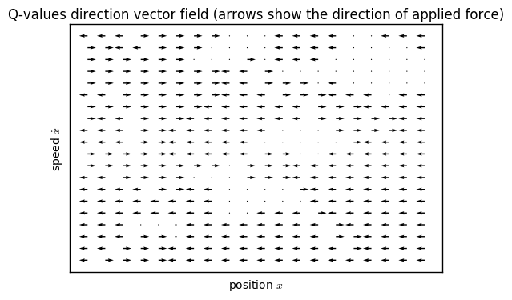
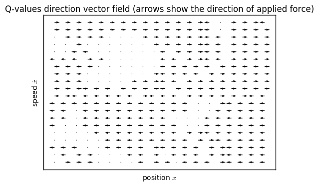
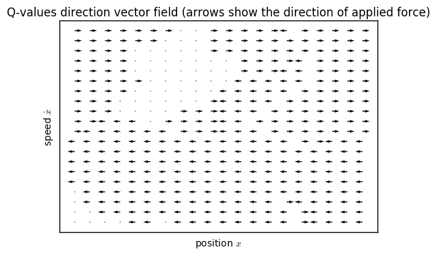
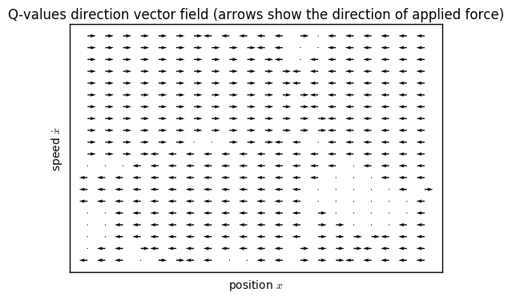
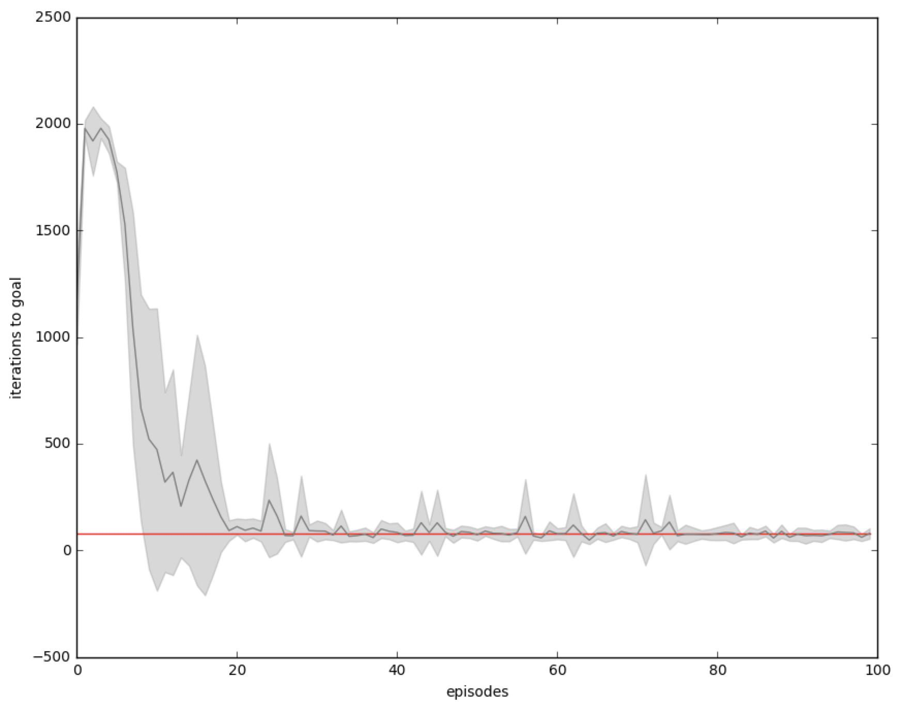
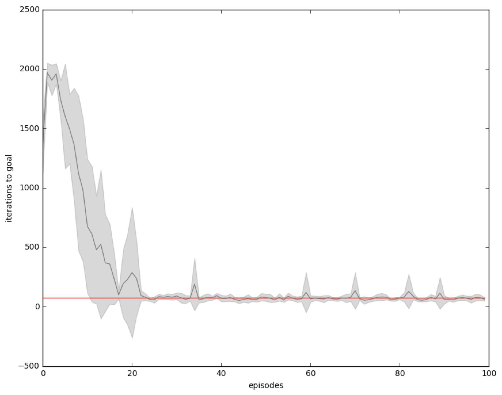
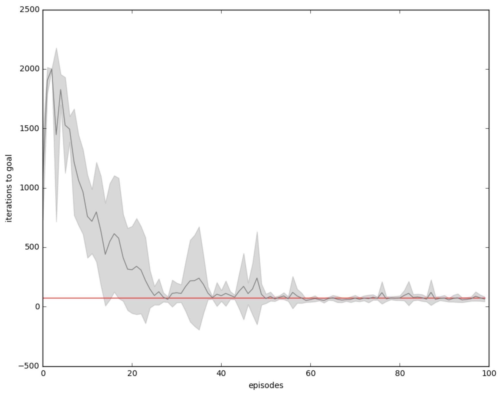
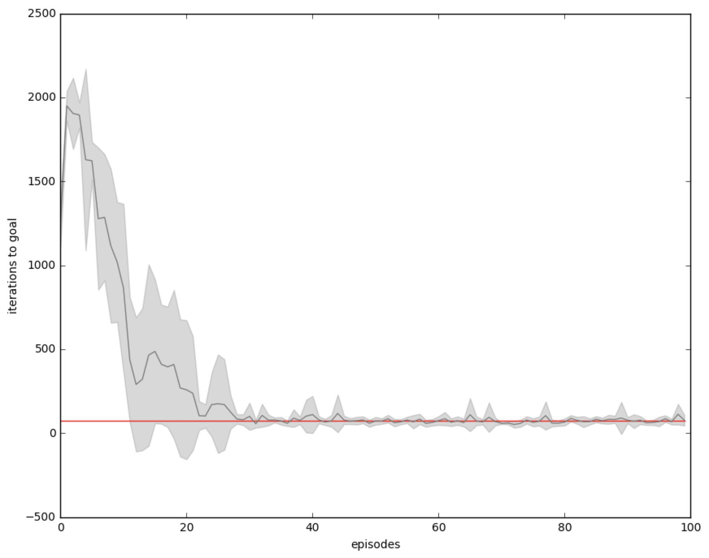

# Vehicule reinforcement learning

Nicolas Casademont, Teo Stocco

*Unsupervised and reinforcement learning in neural networks* 2016 class, EPFL.

## Abstract

Using reward-based learning, this project shows how a car agent can learn to climb a steep hill by accelerating forwards and backwards at appropriate times. It analyses methods for hyperparameter tuning and visualizations of the progresses across various plots.

## Gridsearch

We used a general grid search algorithm across the following parameters. Both $0$ and $1$ have been tried as initialization for weights. Many $\lambda$'s and $\tau$'s have been tested to find a well behaving combinaison: $\lambda=0.05$, $\tau=0.1$ and intialization with $0$. In the following and except for the escape latency, all plots are the average of 8 agents running in parallel with corresponding variances (grey area). The orange line represents the average iteration over the last 60 episodes.

## Escape latency

The following shows the learning curve of 20 agents (light blue traces) and the average (dark blue) of those runs with its variance (grey area). The time to solve this task is highly varying at the beginning but as more and more agents are learning it is going down. Although almost all agents are converging from episode 20, some particular one still need longer to terminate. This can be caused either by some bad luck at drawing the initial state or the agent not having enough knownledge on rare or complex path to take.

## Q-values visualization

The behavior of the agent is quickly evolving as the learning algorithm converges. On the first plot (10th episode), the agent has already learnt some kind of strategy (i.d. no naive forward action on every state as it was at first, instead some element of balancing) but it is not perfect as some close states are contradictive. One could expect to see some areas leading to a better balancing for achieving the task. This is exactly what the next plots are showing (25th, 50th and 100th episodes). The agent learns a global strategy for balacing upon some states where only going forwards leads to the goal. The "empty" areas describe the states where the agent is rarely going through and thus not well trained.

Left arrow represents backward action, right arrow forward action and dots no acceleration. The four vector fields are ordered at different episodes of the learning algortihm: 10, 25, 50 and 100.

## Temperature

The temperature parameter affects the exploration versus exploitation behaviour. When learning the agent should first explore all states to be able to correctly estimate the corresponding q-values. After learning the agent already knows the optimal strategy according to its experience and therefore should not do any tries and only follow the best action. This can be controlled using the temperature parameter. A null temperature will consider only best action, a $0.1$ temperature will choose very often the best one (as in the first plot $\tau=0.1$) while a higher temperature will choose an action at random (as in the third plot $\tau=10$). Therefore a low temperature is good for exploitation and a high temperature good for exploration. One can vary it from high to low and thus have a mixed agent that learns first and perform seconds (as in fourth plot, it also converges faster).

These learning curves demonstrate the different values of tau. In order we have $\tau=0.1$, $\tau=1$, $\tau=10$ and tau decaying from $1$ to $0.1$.

The first plot shows how tau impacts q-values of $\{0.3, 0.2, 0.1\}$ against the probability (given by the softmax function) of drawing the related actions. The second shows the tau decay we used from $1$ to $0.1$.

## Learning curve and eligibility traces

The eligibility trace helps to converge faster by memorizing and updating all previous states when reaching the goal. By setting $\lambda=0$, we can see that the learning algorithm converges slower when it is not updating previous states. Having a good memory can also be penalizing as bad episodes impact negatively lots of q-values. Thus we found that having a trace decay rate of $\lambda=0.05$ was the best fit.

The plots shows no eligibility trace, an eligibility trace of $\lambda=0$, $\lambda=0.05$ and $\lambda=0.95$.

## Initialization

We expected the initialization of the weights to be the best with some nonzero random jitter but it turned out to be better to start with null weights and let the learning updating necessary ones. One could explain this by assuming that fully connected neural networks (all weights initialized to $1$'s) might require more episode to converge (it requires time to shape correctly those values). Having no connection at start allows the net to only take into account the required ones.

The first two plots start both with $0$ (respectively $\lambda=\{0.05,0.25\}$) while the last used $1$ as initilization (respectively $\lambda=\{0.05,0.25\}$).

## Conclusion

Comparing all parameters combinaisons evaluated by the grid search algorithm allowed us to better see how each one impacted the learning. Even though at first we had issues obtaining a fast convergence, adding a penalizing term to the q-values error delta solved that issue. It enhances the agent by prioritizing the shorter runs over longer (thus worst) ones ending up in a globally better and more precise learning.
